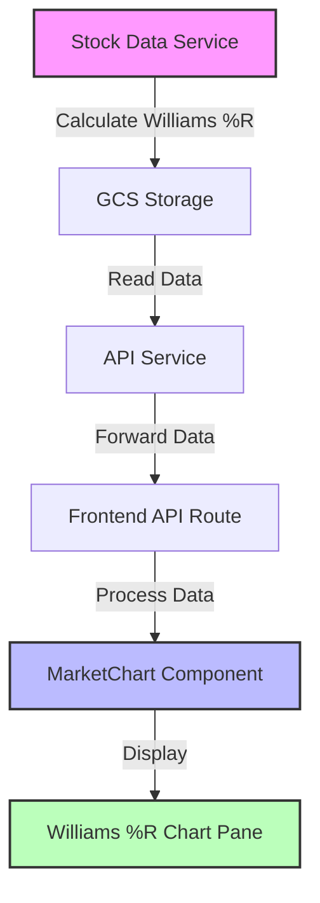

# Williams %R Implementation Flow

## Architecture Overview



## Data Flow

### 1. Download/Update Process
```
User triggers download -> Stock Data Service fetches prices
                      -> Calculator computes Williams %R
                      -> Data saved to GCS with indicators
```

### 2. Display Process
```
User checks Williams %R -> Frontend requests chart data
                       -> API service retrieves from GCS
                       -> Frontend renders Williams %R pane
```

## File Changes Summary

### Backend (stock-data-service)
```
├── app/
│   └── indicators/
│       ├── config.py          # Add WILLIAMS_R_14 to lists
│       └── calculator.py      # Add _calculate_williams_r method
```

### Frontend
```
├── src/
│   ├── app/
│   │   └── market/
│   │       └── market-content-enhanced.tsx  # Add williamsr14 checkbox
│   └── components/
│       └── charts/
│           └── MarketChart.tsx              # Add Williams %R rendering
```

## Critical Implementation Points

### 1. Backend Configuration
```python
# config.py - Add to FULL_INDICATORS
"WILLIAMS_R_14"

# config.py - Add to indicator sets
"chart_full": [..., "WILLIAMS_R_14"]

# config.py - Add minimum periods
"WILLIAMS_R_14": 14

# config.py - Add metadata
"WILLIAMS_R_14": {
    "display_name": "Williams %R (14)",
    "category": "momentum",
    "description": "14-day Williams Percent Range",
    "outputs": ["Williams_R"]
}
```

### 2. Frontend Initialization (CRITICAL!)
```typescript
// MarketChart.tsx - Must add to indicatorOrder
const indicatorOrder = [
    'volume', 'sma20', 'sma50', 'sma200', 'ema20', 'bb20',
    'macd', 'rsi14', 'adx14', 'atr14', 'williamsr14'  // <-- ADD THIS
];
```

### 3. Y-Axis Configuration
```typescript
// Williams %R specific Y-axis settings
const williamsrAxisIndex = addNewYAxis('Williams %R', {
    min: -100,    // Fixed minimum
    max: 0,       // Fixed maximum
    tickInterval: 20,
    plotLines: [
        { value: -20, label: 'Overbought' },
        { value: -80, label: 'Oversold' }
    ]
});
```

## Testing Workflow

1. **Start Services**
   ```bash
   ./scripts/local-start-frontend.sh    # Port 3100
   ./scripts/local-start-api-service.sh  # Port 8002
   ./scripts/local-start-stock-data.sh   # Port 9000
   ```

2. **Re-download Test Symbol**
   ```bash
   # Delete existing data
   curl -X DELETE http://localhost:9000/api/v1/data/AAPL
   
   # Re-download with indicators
   curl -X GET http://localhost:9000/api/v1/download/AAPL
   ```

3. **Verify Data**
   - Check GCS bucket for WILLIAMS_R_14 in JSON
   - Test API endpoint returns Williams %R data
   - Verify frontend displays correctly

## Common Issues and Solutions

| Issue | Solution |
|-------|----------|
| Williams %R not showing | Check indicatorOrder array includes 'williamsr14' |
| No data returned | Re-download symbol to calculate Williams %R |
| Y-axis wrong range | Ensure min: -100, max: 0 in axis config |
| TypeScript errors | Make indicators properties optional with ? |
| Checkbox not working | Verify activeIndicatorCount includes williamsr14 |

## Deployment Notes

- After deploying to production, ALL symbols need re-downloading
- Consider implementing a batch re-calculation script
- Monitor logs for calculation errors
- Test with multiple symbols before full rollout